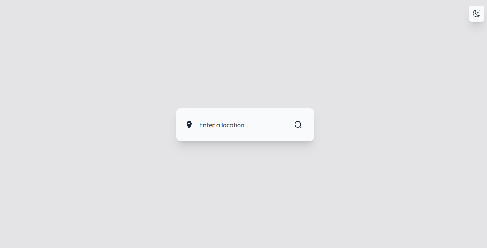
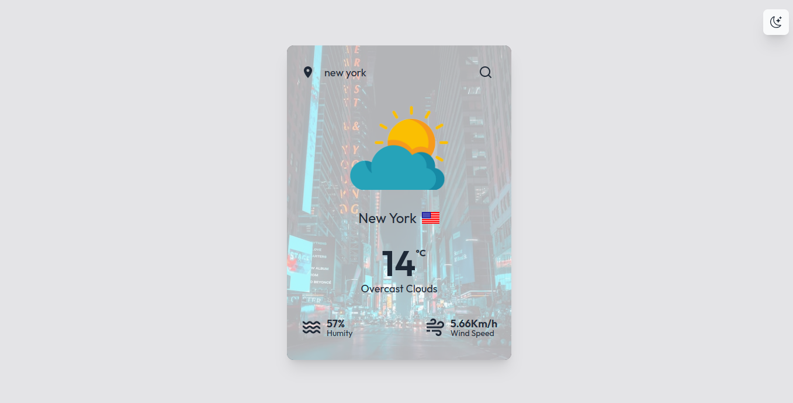
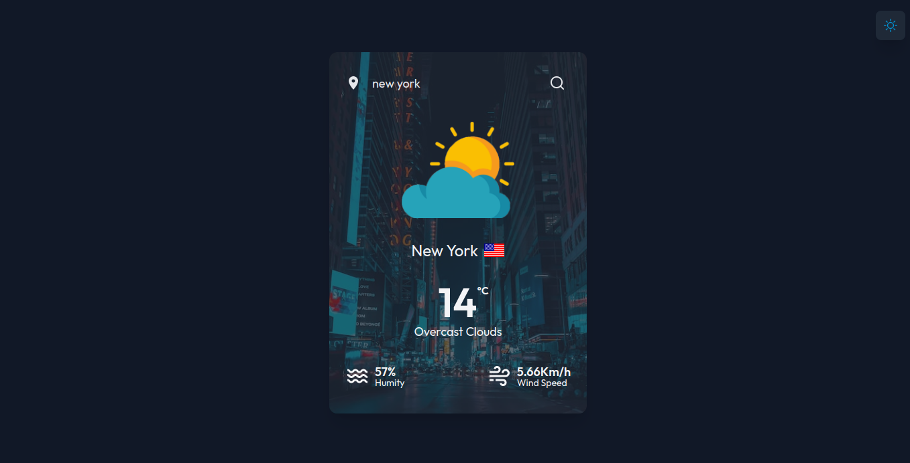
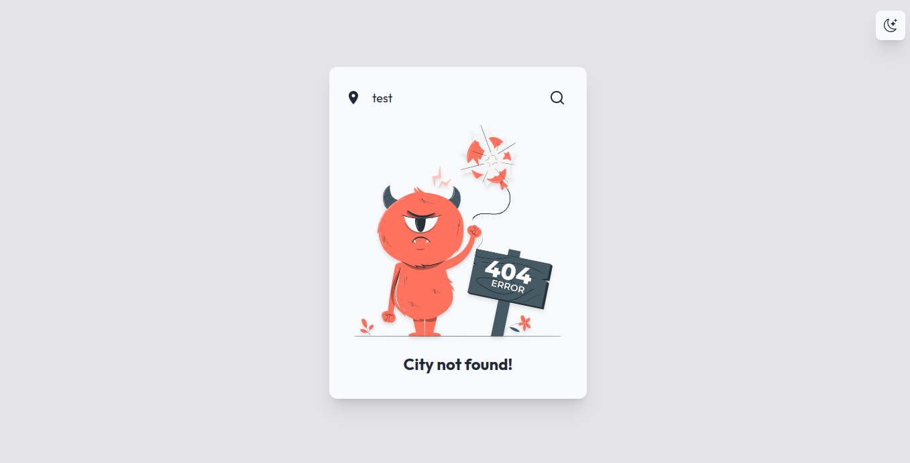

# GWeather

This is a React application that allows you to query weather information for a specific location and display an image representing the weather at that location. To obtain this information, the application makes use of two external APIs: OpenWeatherMap, Unsplash and country flag icon.

## Technologies used

- React
- TypeScript
- Axios
- React Icons
- TailwindCSS
- [Country flags API](https://flagsapi.com/)
- [Open Weather API](https://openweathermap.org/api)
- [Unsplash API](https://unsplash.com/developers)
- [Web illustrations by Storyset](https://storyset.com/web)

## How to use

To use the application, just access the link [https://gweather-eight.vercel.app/](https://gweather-eight.vercel.app/)

## How to install locally

### Requirements

- <a href="https://nodejs.org/">Node.JS</a>
- A text editor such as <a href="https://code.visualstudio.com/">VSCode</a>

1. Download the project to your computer or clone the repository using the following command:

```Shell
git clone https://github.com/Guilherme-Silva0/gweather.git
```

2. Open the terminal in the project directory and run the following command to install the dependencies:

```Shell
npm install
```

3. Then run the following command to launch the application:

```Shell
npm run dev
```

4. The application will open in your browser at the address [http://localhost:5173](http://localhost:5173).

5. Create an `.env.local` file in the project root and add your OpenWeatherMap and Unsplash API keys as follows:

```.env
VITE_API_KEY_WEATHER=your-key-OpenWeatherMap
VITE_API_KEY_UNSPLASH=your-key-Unsplash
```

## Functionalities

When you open the application, you will see a field to enter the name of a place and a "Search" button. To get the weather information and image of the place, just type the name of the place and click the button.

The application will display the following information:

- place name
- Current temperature (in degrees Celsius)
- Description of the weather state (e.g. "rain", "clear sky")
- Country
- Relative air humidity (in percent)
- Wind speed (in km/h)

In addition, the application will display an image that represents the weather in the searched location. If an image for the location cannot be found, a default image will be displayed, and the background image will change according to the location.

## Screeshots

- Search area:
  

- weather information:
  

- weather information Dark Mode:
  

- 404 alert:
  

- 404 alert Dark Mode:
  

## License

This project is licensed under the MIT. For more information, see the LICENSE file.

## Final considerations

Hope you enjoyed this project! If you have any questions or suggestions, please feel free to get in touch.
